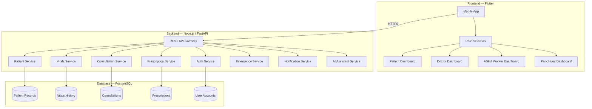

# Gram Setu — Architecture Documentation

## System Architecture



---

## Folder Structure

```
gram_setu/
├── lib/
│   ├── main.dart                    # App entry, routes, theme
│   ├── core/
│   │   ├── app_colors.dart          # Color palette & gradients
│   │   └── theme.dart               # Material 3 theme
│   ├── widgets/
│   │   ├── gram_app_bar.dart        # Branded AppBar with SOS
│   │   ├── stat_card.dart           # Dashboard stat cards
│   │   ├── action_card.dart         # Quick action list items
│   │   └── section_header.dart      # Section title widget
│   ├── pages/
│   │   ├── home.dart                # Role selection screen
│   │   ├── login.dart               # Login / UID entry
│   │   ├── patient.dart             # Patient dashboard
│   │   ├── doctor.dart              # Doctor dashboard
│   │   ├── asha_worker.dart         # ASHA worker dashboard
│   │   ├── panchayat.dart           # Panchayat dashboard
│   
│   │   ├── emergency.dart           # SOS emergency screen
│   │   ├── consultation_screen.dart # Book consultation
│   │   ├── prescription_viewer.dart # View prescriptions
│   │   ├── medicine_reminder.dart   # Medicine schedule
│   │   ├── health_history.dart      # Vitals & history
│   │   ├── health_assistant.dart    # AI chat bot
│   
│   │   ├── health_profile.dart      # Patient profile
│   │   └── vitals_recorder.dart     # ASHA vitals form
│   ├── models/                      # Data models (future)
│   ├── services/                    # API services (future)
│   └── providers/                   # State management (future)
├── docs/
│   └── architecture.md              # This file
├── backend/                         # Backend server (future)
│   ├── src/
│   │   ├── routes/
│   │   ├── controllers/
│   │   ├── models/
│   │   ├── middleware/
│   │   └── services/
│   └── package.json
└── pubspec.yaml
```

---

## REST API Endpoints

### Authentication
| Method | Endpoint | Description |
|--------|----------|-------------|
| POST | `/api/auth/register` | Register new user with role |
| POST | `/api/auth/send-otp` | Send OTP to phone |
| POST | `/api/auth/verify-otp` | Verify OTP and get token |
| GET | `/api/auth/me` | Get current user profile |

### Patients
| Method | Endpoint | Description |
|--------|----------|-------------|
| POST | `/api/patients` | Register new patient (Panchayat) |
| GET | `/api/patients/:uid` | Get patient by UID |
| PUT | `/api/patients/:uid` | Update patient profile |
| GET | `/api/patients/:uid/history` | Full health history |
| GET | `/api/patients/search?q=` | Search patients |

### Vitals
| Method | Endpoint | Description |
|--------|----------|-------------|
| POST | `/api/vitals/:uid` | Record vitals (ASHA worker) |
| GET | `/api/vitals/:uid` | Get vitals history |
| GET | `/api/vitals/:uid/latest` | Latest vitals reading |

### Consultations
| Method | Endpoint | Description |
|--------|----------|-------------|
| POST | `/api/consultations` | Request consultation |
| GET | `/api/consultations/:id` | Get consultation details |
| PUT | `/api/consultations/:id` | Update (doctor response) |
| GET | `/api/consultations/patient/:uid` | Patient's consultations |
| GET | `/api/consultations/doctor/:id` | Doctor's schedule |

### Prescriptions
| Method | Endpoint | Description |
|--------|----------|-------------|
| POST | `/api/prescriptions` | Create prescription (doctor) |
| GET | `/api/prescriptions/:id` | Get prescription |
| GET | `/api/prescriptions/patient/:uid` | Patient's prescriptions |

| PUT | `/api/prescriptions/:id/deliver` | Update delivery status |

### Emergency
| Method | Endpoint | Description |
|--------|----------|-------------|
| POST | `/api/emergency/sos` | Trigger SOS alert |
| GET | `/api/emergency/active` | Get active emergencies |
| PUT | `/api/emergency/:id/resolve` | Resolve emergency |

### Medicine Reminders
| Method | Endpoint | Description |
|--------|----------|-------------|
| GET | `/api/reminders/:uid` | Get reminders |
| POST | `/api/reminders` | Create reminder |
| PUT | `/api/reminders/:id/taken` | Mark medicine taken |


---

## Database Schema

### users
```sql
CREATE TABLE users (
    id            UUID PRIMARY KEY DEFAULT gen_random_uuid(),
    uid           VARCHAR(12) UNIQUE NOT NULL,   -- Health UID (e.g., UID00VFYV3X3)
    phone         VARCHAR(15),
    name          VARCHAR(100) NOT NULL,
    role          VARCHAR(20) NOT NULL,           -- patient, doctor, asha, panchayat
    age           INTEGER,
    gender        VARCHAR(10),
    village       VARCHAR(100),
    block         VARCHAR(100),
    district      VARCHAR(100),
    language_pref VARCHAR(10) DEFAULT 'hi',
    created_at    TIMESTAMP DEFAULT NOW(),
    updated_at    TIMESTAMP DEFAULT NOW()
);
```

### patient_profiles
```sql
CREATE TABLE patient_profiles (
    id              UUID PRIMARY KEY DEFAULT gen_random_uuid(),
    user_id         UUID REFERENCES users(id),
    blood_group     VARCHAR(5),
    known_conditions TEXT,
    allergies       TEXT,
    medical_history TEXT,
    emergency_contact VARCHAR(15)
);
```

### vitals
```sql
CREATE TABLE vitals (
    id              UUID PRIMARY KEY DEFAULT gen_random_uuid(),
    patient_uid     VARCHAR(12) REFERENCES users(uid),
    recorded_by     UUID REFERENCES users(id),   -- ASHA worker
    bp_systolic     INTEGER,
    bp_diastolic    INTEGER,
    heart_rate      INTEGER,
    spo2            INTEGER,
    blood_sugar     DECIMAL(5,1),
    weight          DECIMAL(5,2),
    temperature     DECIMAL(4,1),
    symptoms        TEXT,
    recorded_at     TIMESTAMP DEFAULT NOW()
);
CREATE INDEX idx_vitals_patient ON vitals(patient_uid);
```

### consultations
```sql
CREATE TABLE consultations (
    id          UUID PRIMARY KEY DEFAULT gen_random_uuid(),
    patient_uid VARCHAR(12) REFERENCES users(uid),
    doctor_id   UUID REFERENCES users(id),
    requested_by UUID REFERENCES users(id),    -- could be panchayat
    symptoms    TEXT,
    urgency     VARCHAR(20) DEFAULT 'normal',  -- normal, high, emergency
    status      VARCHAR(20) DEFAULT 'pending', -- pending, matched, active, completed
    diagnosis   TEXT,
    notes       TEXT,
    created_at  TIMESTAMP DEFAULT NOW(),
    completed_at TIMESTAMP
);
```

### prescriptions
```sql
CREATE TABLE prescriptions (
    id              UUID PRIMARY KEY DEFAULT gen_random_uuid(),
    consultation_id UUID REFERENCES consultations(id),
    patient_uid     VARCHAR(12) REFERENCES users(uid),
    doctor_id       UUID REFERENCES users(id),
    medicines       JSONB NOT NULL,       -- [{name, dosage, duration, frequency}]
    notes           TEXT,
    status          VARCHAR(20) DEFAULT 'active', -- active, dispensed, completed
    delivery_status VARCHAR(30),          -- pending, ready_pickup, delivered

    created_at      TIMESTAMP DEFAULT NOW()
);
```

### emergencies
```sql
CREATE TABLE emergencies (
    id          UUID PRIMARY KEY DEFAULT gen_random_uuid(),
    patient_uid VARCHAR(12) REFERENCES users(uid),
    symptoms    TEXT[],
    location    VARCHAR(200),
    status      VARCHAR(20) DEFAULT 'active', -- active, responding, resolved
    resolved_by UUID REFERENCES users(id),
    created_at  TIMESTAMP DEFAULT NOW(),
    resolved_at TIMESTAMP
);
```


### medicine_reminders
```sql
CREATE TABLE medicine_reminders (
    id          UUID PRIMARY KEY DEFAULT gen_random_uuid(),
    patient_uid VARCHAR(12) REFERENCES users(uid),
    medicine    VARCHAR(100),
    dosage      VARCHAR(100),
    time        TIME,
    period      VARCHAR(20),     -- morning, afternoon, night
    taken       BOOLEAN DEFAULT FALSE,
    date        DATE DEFAULT CURRENT_DATE
);
```

---

## Security Model

### Authentication
- **OTP-based** phone authentication (SMS gateway: MSG91 / Twilio)
- **JWT tokens** for API authorization (access + refresh tokens)
- Token refresh every 24 hours; revocation on logout

### Role-Based Access Control (RBAC)
| Resource | Patient | Doctor | ASHA | Panchayat |
|----------|---------|--------|------|-----------|------------|
| Own profile | RW | RW | RW | RW |
| Patient records | Own only | Assigned | Assigned | Village | — |
| Vitals | Read own | Read assigned | Read/Write | Read | — |
| Consultations | Create/Read | Read/Write | Read | Create/Read | — |
| Prescriptions | Read own | Create/Read | Read | Read | Read |
| Emergency | Create | Respond | Create | Create/Respond |

### Data Protection
- **Encryption at rest**: AES-256 for patient medical records
- **TLS 1.3** for all API communication
- **Data minimization**: Each role sees only permitted fields
- **Audit logging**: All access to patient records is logged
- **HIPAA-aligned principles**: Consent tracking, breach notification

---

## AI Health Assistant — Safety Rules

1. **Only preventive guidance** — never diagnoses or prescribes
2. **Mandatory disclaimer** on every response
3. **Emergency keyword detection** → auto-triggers SOS recommendation
4. **No personal health data storage** from chat sessions
5. **Approved response templates** for common symptoms only
6. **Escalation path**: "If symptoms persist → consult doctor"

---

## Deployment Plan

### Mobile App (Flutter)
1. Build APK: `flutter build apk --release`
2. Build App Bundle: `flutter build appbundle`
3. Distribute via:
   - Google Play Store (primary)
   - Direct APK download (for rural areas with Play Store issues)
   - Sideloading via Panchayat offices

### Backend
1. **Hosting**: AWS EC2 / Google Cloud Run / Railway
2. **Database**: AWS RDS PostgreSQL / Supabase
3. **File storage**: AWS S3 for medical documents
4. **SMS service**: MSG91 (India-focused, affordable)
5. **CI/CD**: GitHub Actions → build → test → deploy

### Infrastructure
```
Internet → CloudFlare CDN → Load Balancer → API Servers (2+)
                                              ↓
                                        PostgreSQL (Primary + Replica)
                                              ↓
                                        Redis (session cache)
```

### Monitoring
- **Uptime**: UptimeRobot / Better Stack
- **Errors**: Sentry for crash reporting
- **Analytics**: Firebase Analytics (free tier)
- **Logs**: CloudWatch / Google Cloud Logging
